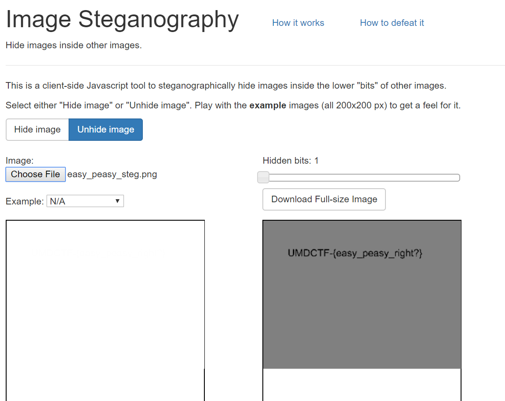

There was a CTF challenge on campus, and for extra credit my instructors said we could attempt some of the challenges. 

--- 

<b>Stenography - Scout out the flag </b>

I noticed a bar on the bottom and right edges of the picture, so I knew there was something hidden in the pixels. I googled some online stenography tools, and after playing around for a while I ended up finding this: https://incoherency.co.uk/image-steganography/#unhide. Putting the picture into the software yielded the results below:




<b> Crypto - Transportation Cipher </b>

In this puzzle, I was given a flight itinerary and a list of nights, given [here](https://github.com/UMD-CSEC/UMDCTF-2017-Challenges/tree/master/Crypto/Transportation_Cipher). After playing arounf with the nights nad tying to find a relationship between teh locations, I was recommended by an instructor to look up the flight codes for each location, so for eaxample Baltimore might become BWI. After this it was just a matter of translating each location to it's airport codes, for which I used [this site](https://www.world-airport-codes.com/). I was able to decrypt the message to be 
```
FLA -> GIS
MAR -> YLA
NDR -> ULE
SAT -> CTF
```
which reads across as 'Flag is Maryland rules at CTF'. 

Then all I had to do was figure out how the flag was formatted. I soon got `echo -n "UMDCTF-{marylandrulesatctf}" | sha256sum` to output the same sha256sum as the one on the challenge page. Puzzle complete!

<b> Reverse Engineering - Baby's First RE </b>

Next up was [this](https://github.com/UMD-CSEC/UMDCTF-2017-Challenges/tree/master/Reverse%20Engineering/Babys_First_RE) challenge. I opened up the ELF file in radare2, saw a funky-looking baby made in ascii art, and a weird long string `VU1EQ1RGLXsxX1NlZV9QcjMzdHlfU3RyaW5nel9ldmVyeXdoZXJlXzFfZ299`. I wasn't really sure what to do with it, so I looked around the rest of the code, but it seemed like that was the clue. On a whim I decided to try and see if it was encoded in Base64 (like one of the easter eggs in class we had one time), and sure enough it was! I was rewarded with this flag -> `UMDCTF-{1_See_Pr33ty_Stringz_everywhere_1_go}`. Woot woot!
